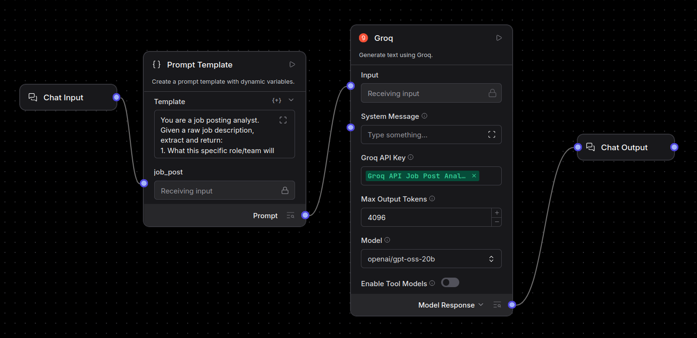

# Job Post Analyzer (Low-Code AI / Langflow)
 
A low-code AI tool built in [Langflow](https://www.langflow.org/) that takes a raw
job posting and returns: what the role actually works on, key required skills, a
tailored cover-letter intro line, and red flags / vague buzzwords.
 
Job postings are often long and hard to parse. This tool saves time and effort when
going through many of them, by pulling out the parts that actually matter.
 
## Stack
- **Langflow** - visual low-code pipeline builder (Python-based)
- **Groq** (`openai/gpt-oss-20b`) - LLM backend, swappable in the flow

## Pipeline
**Chat Input → Prompt Template → Groq → Chat Output**
 

 
Importable flow: `job-post-analyzer.json`
 
**Prompt used** (full text in `job-post-analyzer-flow.json`, condensed here):
> Given a raw job posting, extract: (1) what this specific role/team actually works
> on - concrete product/problem area, not just the title, flagged explicitly if
> unclear; (2) key required skills, ranked; (3) a one-line cover-letter intro; (4)
> red flags / vague buzzwords. Blunt, concise, no filler.
 
## Running it locally
```bash
python3 -m venv venv
source venv/bin/activate
uv pip install langflow
langflow run
```

Open the Langflow UI (\`http://localhost:7860\`), import \`job-post-analyzer-flow.json\`,
add your own Groq API key as a global variable, and chat with it in the Playground.
 
## Example run
See [\`EXAMPLE.md\`](./EXAMPLE.md) for a full input/output example on a real posting.
 
## Known limitations
- Reasoning-capable Groq models can occasionally return empty/truncated responses;
  Max Output Tokens set to 4096 to reduce this, no retry logic implemented.
- Output quality depends on how much detail the original posting includes.

## What I'd improve with more time
- Retry logic for API timeouts / empty responses
- RAG over past cover letters to personalize the intro line further
- Score postings against a candidate's resume
- Deploy via Langflow's API endpoint behind a small frontend
 
